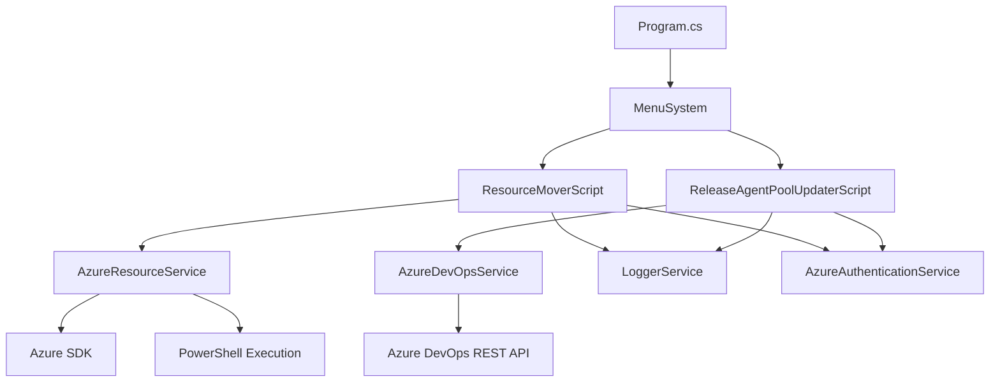

# Azure Resource Management Tools - System Patterns

## Architecture Overview

The application follows a service-oriented architecture with clear separation of concerns. The application is structured as follows:

## Key Design Patterns

### 1. Service-Oriented Architecture
The application is organized into specialized services, each with a specific responsibility:

- **AzureResourceService**: Core service for discovering and moving resources
- **LoggerService**: Handles all logging with different severity levels
- **AzureAuthenticationService**: Manages Azure authentication and subscription selection

This pattern promotes:
- Separation of concerns
- Testability
- Maintainability
- Single responsibility principle

### 2. Command Pattern
The script execution follows a command pattern where:

- **ResourceMoverScript** encapsulates the command execution logic
- **CommandOptions** represents the command parameters
- **ScriptResult** captures the outcome of the command execution

This allows for:
- Decoupled execution logic
- Consistent result handling
- Future extensibility for new commands

### 3. Strategy Pattern
Resource discovery implements a strategy pattern:

- Different discovery methods for different resource types (KeyVault, Service Bus)
- Common interface for adding resources to the collection
- Fallback mechanisms when primary discovery methods fail

This enables:
- Extension to new resource types
- Consistent handling of different resource types
- Resilience to permission issues

### 4. Data Transfer Objects
The application uses DTOs to represent:

- **ResourceInfo**: Resource metadata and mapping information
- **ScriptResult**: Operation results including errors and execution time
- **SubscriptionInfo**: Azure subscription details

### 5. Regular Expression Strategy
A critical pattern is the use of regular expressions to:

- Extract tenant IDs from resource names
- Match resources to their corresponding web apps
- Validate resource naming conventions

## Technical Decisions

### 1. PowerShell Command Execution
The application uses PowerShell's `Move-AzResource` command for resource movement, rather than direct API calls. This decision was made because:

- PowerShell commands are more reliable for resource group operations
- They include built-in validation and error handling
- They provide better compatibility with Azure's management layer

### 2. Generic Resource Discovery Fallback
The application first attempts to use specialized resource-type APIs but falls back to generic resource enumeration when:

- Permission issues might prevent direct API access
- More comprehensive resource information is needed
- Greater resilience is required

### 3. Tenant ID-Based Resource Grouping
Resources are grouped by tenant ID before processing, which:

- Ensures logical organization of moves
- Prevents partial moves of related resources
- Simplifies association with target resource groups

### 4. Comprehensive Logging
The application implements verbose, multi-level logging that:

- Documents each step of the process
- Provides debugging information
- Records both successes and failures
- Makes the tool behavior transparent to users

## Azure DevOps Release Agent Pool Updater Patterns

### 1. REST API Client Pattern
The Azure DevOps Release Agent Pool Updater uses a REST API client pattern instead of the SDK:

- **Direct HTTP Requests**: Uses HttpClient for direct REST API calls
- **JSON Serialization/Deserialization**: Parses and manipulates JSON responses
- **Authentication Headers**: Passes Azure AD tokens via Authorization headers

This approach was chosen because:
- It provides more flexibility with the latest API versions
- It avoids compatibility issues with the Azure DevOps SDK
- It allows for more direct control over request/response handling

### 2. JSON Document Transformation
The updater uses a pattern of JSON document transformation for modifying release definitions:

- **Read**: Fetch the complete JSON document representing a release definition
- **Transform**: Modify specific nodes (agent pool name) while preserving the structure
- **Write**: Post the modified document back to the API

This approach ensures:
- Minimal changes to the document structure
- Preservation of all existing configuration
- Reliable updates even with complex document structures

### 3. Operation Batching
The updater implements operation batching by:

- **Discovery Phase**: First finds all matching release definitions
- **Validation Phase**: Validates that the agent pool exists before attempting updates
- **Update Phase**: Processes updates in series with detailed logging
- **Summary Phase**: Provides aggregated results of the operation

## Error Handling Strategy

Both tools implement a robust error handling approach:

1. **Try-Catch Blocks**: Around all external operations
2. **Error Collection**: Aggregation of all errors in the ScriptResult
3. **Warning Generation**: For non-fatal issues (like missing resources or non-existent agent pools)
4. **Graceful Degradation**: Continuing operation when possible despite errors
5. **Detailed Error Messages**: Including both user-friendly and technical details
6. **Validation Before Execution**: Checking prerequisites before making changes
